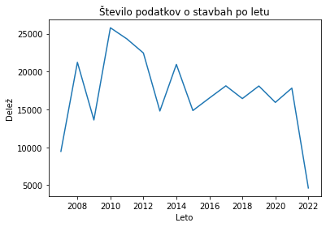
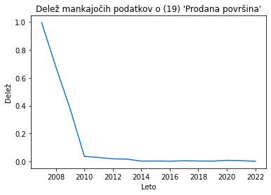
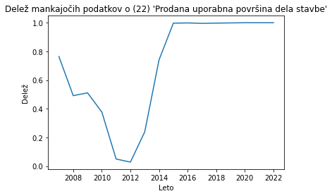
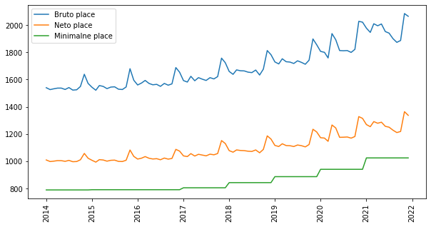
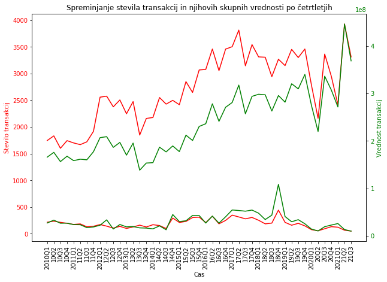

# Analiza nepremičnin in prihodkov prebivalstva

Sodelujoči:

- Rok Švikart
- Martin Čučkin
- Luka Kalin

# Povezave do podatkov:

Podatki o nepremičninah: https://podatki.gov.si/dataset/surs0419030s, 
                                          https://podatki.gov.si/dataset/evidenca-trga-nepremicnin
                                          
Podatki o prihodkih: https://www.gov.si/teme/minimalna-placa/, 
                       https://pxweb.stat.si/SiStatData/pxweb/sl/Data/-/0701011S.px


# Uvod

Nepremičninski trg je zelo pomemben za vsakega posameznika, saj vsi potrebujemo prebivališče ali delovne prostore, če želimo ustanoviti svoje podjetje ali manjši posel. Zaradi gotovosti, da se bomo v prihodnosti vsi srečevali s tem trgom, smo se v skupini odločili narediti projekt o nepremičninskem trgu in o njegovi možni prihodnosti. 

# Opis problema

Pri nalogi si želimo predstaviti obnašanje nepremičnin na trgu, ter prihodkov prebivalstva. Želimo analizirati trende o cenah, ali rastejo, padajao ali pa stagnirajo. S to analizo podatkov, bi lahko odgovorili na vprašljivo prihodnost nepremičninskega trga in vprašanja ali bo oseba glede na povprečne prihodke v Sloveniji na tem trgu lahko sodelovala, ali je to v današnjih časih vedno težje.

# Podatki

Pri vmesenm poročili smo uporabili tri različne podatkovne datoteke, in sicer:

    - min_place.csv - manjša datoteka z minimalnimi plačami v Sloveniji skozi leta 2010 - 2021
    
    - povp_place.csv - datoteka, ki vsebuje povprečno bruto plačo za mesec in tromesečje in povprečno neto plačo za posamezen mesec in tromesečje v obdobjih 2014 - 2021

    - st_in_vrednost_nepremicnin.csv - datoteka, ki vsebuje podatke o številu transakcij in njihovih skupnih prihodkih glede na četrtletja v obdobju 2010 - 2021 za posamezne tipe nepremičnine, ki pa so:
        - Nova stanovanja
        - Nove družinske hiše
        - Rabljena stanovanja
        - Rabljene družinske hiše
    
Preostanejo še podatki o evidenci trga nerpemičnin, katerih se do sedaj še nismo lotili in ostajajo za nadaljevanje projektne naloge. S temi podatki želimo predstaviti obnašanje tudi glede na regije Slovenije, saj ima datoteka za vsako transakcijo, tudi podatek o občini, katere lahko nato razdelimo po regijah.


```python
cenaNaMeter = getAllCnM()
```
    Leto 2007 cena na meter: 1589.7148609612602
    Leto 2008 cena na meter: 4837.010356537396
    Leto 2009 cena na meter: 4159.273340415848
    Leto 2010 cena na meter: 3743.4479749743177
    Leto 2011 cena na meter: 2775.8632679091434
    Leto 2012 cena na meter: 3546.1035434833743
    Leto 2013 cena na meter: 1886.054125450965
    Leto 2014 cena na meter: 1300.185275085118
    Leto 2015 cena na meter: 1168.9791923411492
    Leto 2016 cena na meter: 1147.7294070988437
    Leto 2017 cena na meter: 1150.2374186793254
    Leto 2018 cena na meter: 1244.5424858400695
    Leto 2019 cena na meter: 1296.6778445823497
    Leto 2020 cena na meter: 1423.104298621578
    Leto 2021 cena na meter: 1560.6362667229089
    Leto 2022 cena na meter: 2628.8502865434043
    

# Analiza podatkov


    

    


    

    


    

    

    
Zgornji grafi prikazujejo število podatkov, ter delež mankajočih podatkov v dveh stolpcih.


    

    


Graf prikazuje obnašanje prihodkov skozi obdobje 2014 do 2022. Razberemo lahko, da prihodki počasi rastejo, tako povprečna, kot tudi minimalna, kar je logično. Opažamo lahko skoke v koncih vsakega leta. Te skoke najverjetneje povzročijo božični bonusi.


```python
fig, ax = plt.subplots(figsize=(10,7))
ax.set_title("Spreminjanje stevila transakcij in njihovih skupnih vrednosti po četrtletjih")
ax.tick_params('x', labelrotation=90)
ax.set_xlabel('Cas')
ax.set_ylabel('Stevilo transakcij', color='red')
# Plot linear sequence, and set tick labels to the same color
ax.plot(xVrednosti,stareTransakcije, color='red')
ax.plot(noveTransakcije, color='red')
ax.tick_params(axis='y', labelcolor='red')

# Generate a new Axes instance, on the twin-X axes (same position)
ax2 = ax.twinx()

# Plot exponential sequence, set scale to logarithmic and change tick color
ax2.set_ylabel('Vrednost transakcij', color='green')
ax2.plot(stareVrednost, color='green')
ax2.plot(noveVrednost, color='green')
ax2.tick_params(axis='y', labelcolor='green')


plt.show()
```


    

    


Zgornji graf prikazuje rast števila transakcij in njihovih skupnih vrednosti po četrtletjih od leta 2010 do leta 2021. Spnodji del grafa prikazuje podatke za rabljene nepremičnine, zgonrji del pa podatke za nove nepremičnine. Zeleni črti prikazujeta vrednosti transakcij, rdeči lrti pa število transakcij. Razberemo lahko, da je število transakcij novih nepremičnin veliko večje, kot starih. Lahko sklepamo, da se gradnja novih nepremičnin veča, ali pa da se stare nepremičnine ne prodajajo. Lahko sta pa tudi oba primera razlog za razmik. Razberemo lahko tudo da vrednosti sledita trendom števila transakcij. Če število transakcij raste, raste tudi skupna vrednost, kar je logično. Razberljiva sta tudi padca, še predvsem pri novih nepremičninah v času dveh večjih valov okuženosti z COVID-om. Takrat je prodaja padla še posebej pa se padec pozna pri novih nepremičninah, kjer je najverjetneje padla tudi gradnja novih nepremičnin. Kljub padcem se graf novih premičnin hitro vrne nazaj, k svojem trendu naraščanja. Glede rabljenih nepremičnin pa lahko vidimo, da sta od 2010 do 2014 število ter vrednost padala, nato naraščala do leta 2018, in sedaj spet padata. Iz zgornjega dela, ki prikazuje podatke za nove nepremičnine lahko opazimo, da je skupna vrednost transkacij bolj narasla kot število transakcij. Iz tega lahko sklepamo, da se je cena posameznih transakcij povečala.


# Zaključek

Do sedaj smo pregledali podatje o plačah in nepremičninah. Vidimo rast v obeh primerih, vendar če hočemo odgovoriti na naše vprašanje moramo to rast še dodatno primerjati med seboj. V nadaljevanju projektne naloge želimo bolje pregledati trende pri nepremičninah, kar bomo storili s pomočjo podatkov evidence trga nepremičnin. Želeli bi boljšo predstavitev glede na regije in boljšo razdelitev glede na tip nepremičnine.
