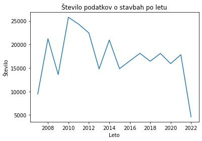
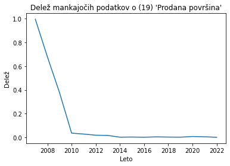
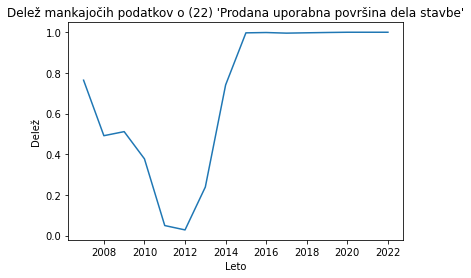
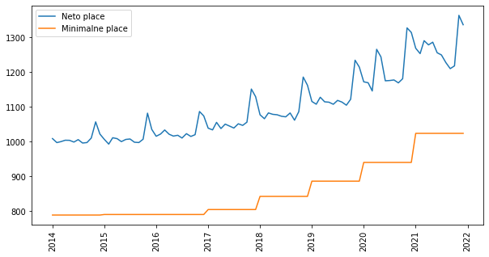
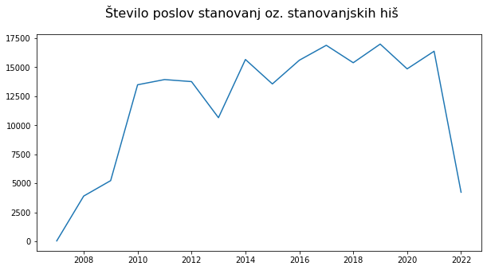
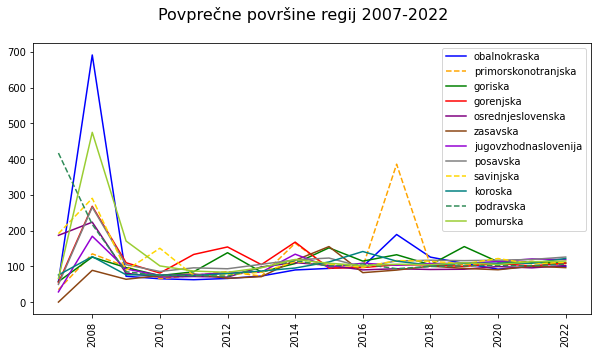
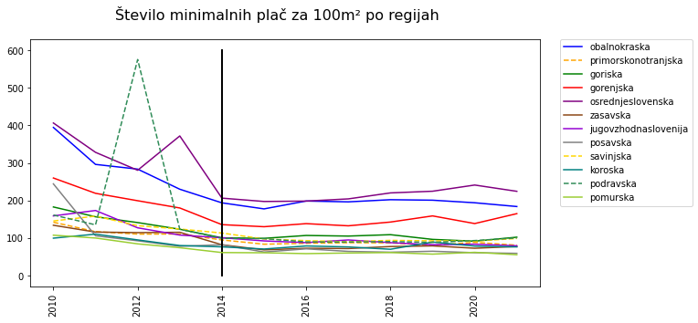
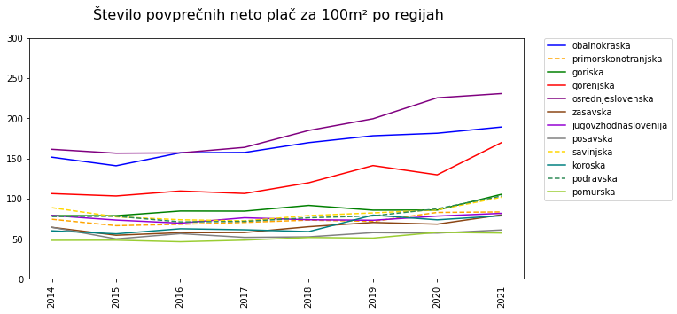

# Analiza nepremičnin in prihodkov prebivalstva

Sodelujoči:

- Rok Švikart
- Martin Čučkin
- Luka Kalin

# Povezave do podatkov:

Podatki o nepremičninah: https://podatki.gov.si/dataset/surs0419030s, 
                                          https://podatki.gov.si/dataset/evidenca-trga-nepremicnin
                                          
Podatki o prihodkih: https://www.gov.si/teme/minimalna-placa/, 
                       https://pxweb.stat.si/SiStatData/pxweb/sl/Data/-/0701011S.px


# Uvod

Nepremičninski trg je zelo pomemben za vsakega posameznika, saj vsi potrebujemo prebivališče ali delovne prostore, če želimo ustanoviti svoje podjetje ali manjši posel. Zaradi gotovosti, da se bomo v prihodnosti vsi srečevali s tem trgom, smo se v skupini odločili narediti projekt o nepremičninskem trgu in o njegovi možni prihodnosti. 

Poročilo: https://github.com/DocChinchillin/PR22RSMCLK/blob/main/README.md <br>
Koda: https://github.com/DocChinchillin/PR22RSMCLK/blob/main/projektna.ipynb

# Opis problema

Pri nalogi si želimo predstaviti obnašanje nepremičnin na trgu, ter prihodkov prebivalstva. Želimo analizirati trende o cenah, ali rastejo, padajao ali pa stagnirajo. S to analizo podatkov, bi lahko odgovorili na vprašljivo prihodnost nepremičninskega trga in vprašanja ali bo oseba glede na povprečne prihodke v Sloveniji na tem trgu lahko sodelovala, ali je to v današnjih časih vedno težje.

# Podatki

Pri vmesenm poročili smo uporabili tri različne podatkovne datoteke, in sicer:

    - min_place.csv - manjša datoteka z minimalnimi plačami v Sloveniji skozi leta 2010 - 2021
    
    - povp_place.csv - datoteka, ki vsebuje povprečno bruto plačo za mesec in tromesečje in povprečno neto plačo za posamezen mesec in tromesečje v obdobjih 2014 - 2021

    - st_in_vrednost_nepremicnin.csv - datoteka, ki vsebuje podatke o številu transakcij in njihovih skupnih prihodkih glede na četrtletja v obdobju 2010 - 2021 za posamezne tipe nepremičnine, ki pa so:
        - Nova stanovanja
        - Nove družinske hiše
        - Rabljena stanovanja
        - Rabljene družinske hiše
    
Preostanejo še podatki o evidenci trga nerpemičnin med leti 2007 ter 2022, razdeljeni na tri datoteke, in sicer delistavb.csv, posli.csv ter zemljisca.csv (format: ETN_SLO_KUP_"leto"_"ime"_20220326.csv). Od teh datotek smo uporabljali podatke v posli.csv in delistavb.csv, nismo pa uporabljali zemljisca.csv. Datoteke vsebujejo veliko podrbobnejših informacij o posameznih transakcijah (površina, regija, občina, opombe...).

# Knjižnice


```python
import csv
from csv import DictReader
import re
import matplotlib
from matplotlib.pyplot import figure
import matplotlib.pyplot as plt
import numpy as np
import sys
```


# Analiza podatkov


    St. pojav | Prvih 150 znakov opombe
       110754 | Prodani solastniški deleži in prodane površine delov stavb so pridobljeni s preračunom podatkov o prodani stavbi. Izvorni podatek o 
          629 |  Prodani solastniški deleži in prodane površine delov stavb so pridobljeni s preračunom podatkov o prodani stavbi. Izvorni podatek o 
          196 |  Prodani solastniški deleži in prodane površine delov stavb so pridobljeni s preračunom podatkov o prodani stavbi. Izvorni podatek o 
          177 | shramba                                                                                                                                               
          171 |  Prodani solastniški deleži in prodane površine delov stavb so pridobljeni s preračunom podatkov o prodani stavbi. Izvorni podatek o 
          127 | Shramba                                                                                                                                               
          123 | SHRAMBA                                                                                                                                               
          121 |  Prodani solastniški deleži in prodane površine delov stavb so pridobljeni s preračunom podatkov o prodani stavbi. Izvorni podatek o 
          108 |  Prodani solastniški deleži in prodane površine delov stavb so pridobljeni s preračunom podatkov o prodani stavbi. Izvorni podatek o 
          107 |  Prodani solastniški deleži in prodane površine delov stavb so pridobljeni s preračunom podatkov o prodani stavbi. Izvorni podatek o 

<br>   


    St. pojav | Prvih 150 znakov opombe
          214 | POGODBA NAMESTO RAZLASTITVE                                                                                                                           
          115 | domik                                                                                                                                                 
          113 | PRODAJNA POGODBA                                                                                                                                      
          113 | NE                                                                                                                                                    
           93 | pogodba namesto razlastitve                                                                                                                           
           78 | sklep o domiku                                                                                                                                        
           75 | RAZLASTITEV                                                                                                                                           
           74 | Razlog predčasnega zaključka : predčasno poplačilo                                                                                                    
           73 | Notarski zapis - Prodajna pogodba                                                                                                                     
           68 | Kupoprodajna pogodba za dosego javne koristi                                                                                                          
    

Zgoraj so izpisani začetki najbolj pogostih opomb.


    

    


    

    


    

    


S pomočjo zgornjih grafov smo se odločili, da uporabimo stolpec (19) 'Prodana površina', saj ima najmanj manjkajočih vrednosti. (Imeli smo več površin v podatkih)


    

    


Graf prikazuje obnašanje prihodkov skozi obdobje 2014 do 2022. Razberemo lahko, da prihodki počasi rastejo, tako povprečna, kot tudi minimalna, kar je logično. Opažamo lahko skoke v koncih vsakega leta. Te skoke najverjetneje povzročijo božični bonusi.


    Kolikokrat se je kot del enega posla kupilo nepremičnine (stanovanje, stanovalsko hišo) iz več regij:
    2007:  0 /    43  0.00%
    2008:  0 /  3904  0.00%
    2009:  2 /  5234  0.04%
    2010:  2 / 13491  0.01%
    2011:  0 / 13939  0.00%
    2012:  1 / 13764  0.01%
    2013:  1 / 10655  0.01%
    2014:  0 / 15668  0.00%
    2015:  0 / 13563  0.00%
    2016:  0 / 15605  0.00%
    2017:  2 / 16891  0.01%
    2018: 17 / 15389  0.11%
    2019: 24 / 16995  0.14%
    2020: 32 / 14861  0.22%
    2021: 35 / 16380  0.21%
    2022: 13 /  4233  0.31%
    

Iz zgornje analize vidimo, da se redko kupijo kot del enega posla stanovanja iz različnih regij.


    

    


    Delež stanovanj z namenom bivališča
    -----------------------------------
    2007: 4844  /  9459 | 51.21%
    2008: 7009  / 21222 | 33.03%
    2009: 7774  / 13607 | 57.13%
    2010: 16180 / 25785 | 62.75%
    2011: 20218 / 24314 | 83.15%
    2012: 19183 / 22455 | 85.43%
    2013: 13031 / 14793 | 88.09%
    2014: 17251 / 20946 | 82.36%
    2015: 14237 / 14854 | 95.85%
    2016: 16062 / 16501 | 97.34%
    2017: 17540 / 18115 | 96.83%
    2018: 15962 / 16433 | 97.13%
    2019: 17724 / 18094 | 97.96%
    2020: 15460 / 15929 | 97.06%
    2021: 17363 / 17818 | 97.45%
    2022: 4526  /  4621 | 97.94%
    

Vidimo, da je pred letom 2011 velik delež stanovanj in stanovanjskih hiš bilo uporabljenih za druge namene kot bivanje. Po letu 2011 pa delež v splošnem narašča.


    

    


    

    


Iz zgornjega grafa je razvidno, da je povprečna površina stanovanja okoli 100m<sup>2</sup>


    

    


    Regija               |   2010 |   2011 |   2012 |   2013 |   2014 |   2015 |   2016 |   2017 |   2018 |   2019 |   2020 |   2021
    --------------------------------------------------------------------------------------------------------------------------------
    obalnokraska         | 394.37 | 295.97 | 283.44 | 229.92 | 193.67 | 177.60 | 198.51 | 196.29 | 202.04 | 200.72 | 193.89 | 183.87
    primorskonotranjska  | 142.10 | 117.10 | 110.52 | 110.77 |  94.94 |  83.60 |  86.01 |  87.71 |  87.17 |  80.64 |  88.47 |  81.06
    goriska              | 182.69 | 156.64 | 141.19 | 123.41 | 100.63 |  99.22 | 106.88 | 105.23 | 108.96 |  96.42 |  91.67 | 102.33
    gorenjska            | 259.80 | 219.05 | 199.33 | 180.03 | 135.69 | 130.15 | 138.32 | 132.56 | 142.56 | 158.92 | 138.53 | 164.96
    osrednjeslovenska    | 406.19 | 328.10 | 280.43 | 371.70 | 206.21 | 197.30 | 198.36 | 204.21 | 220.13 | 224.59 | 241.07 | 224.35
    zasavska             | 134.03 | 115.89 | 114.45 | 115.30 |  82.12 |  68.55 |  72.76 |  72.05 |  77.39 |  79.16 |  72.90 |  77.45
    jugovzhodnaslovenija | 158.93 | 173.31 | 127.23 | 107.91 | 100.84 |  92.36 |  87.84 |  94.95 |  87.71 |  82.22 |  83.61 |  79.36
    posavska             | 244.17 | 106.01 |  92.69 |  78.15 |  82.12 |  62.77 |  71.27 |  64.48 |  62.32 |  64.89 |  61.01 |  59.24
    savinjska            | 145.44 | 158.40 | 132.95 | 124.08 | 113.33 |  97.51 |  93.09 |  90.15 |  93.88 |  92.52 |  91.84 |  98.86
    koroska              |  99.71 | 110.41 |  95.06 |  80.07 |  76.54 |  70.78 |  78.94 |  76.32 |  70.17 |  89.39 |  78.64 |  76.41
    podravska            | 161.26 | 135.19 | 575.09 | 123.42 |  99.13 |  98.40 |  89.71 |  89.31 |  90.64 |  88.37 |  93.29 | 100.36
    pomurska             | 107.59 | 100.07 |  84.53 |  74.27 |  61.39 |  60.78 |  58.52 |  60.17 |  61.37 |  57.20 |  62.00 |  55.58
    


    

    


    Regija               |   2014 |   2015 |   2016 |   2017 |   2018 |   2019 |   2020 |   2021
    --------------------------------------------------------------------------------------------------------------------------------
    obalnokraska         | 151.44 | 140.77 | 156.91 | 157.31 | 169.58 | 178.12 | 181.25 | 189.01
    primorskonotranjska  |  74.24 |  66.26 |  67.98 |  70.29 |  73.16 |  71.56 |  82.70 |  83.32
    goriska              |  78.69 |  78.64 |  84.48 |  84.33 |  91.45 |  85.56 |  85.69 | 105.19
    gorenjska            | 106.10 | 103.16 | 109.33 | 106.24 | 119.65 | 141.02 | 129.50 | 169.57
    osrednjeslovenska    | 161.25 | 156.39 | 156.79 | 163.65 | 184.75 | 199.29 | 225.36 | 230.63
    zasavska             |  64.21 |  54.33 |  57.51 |  57.74 |  64.95 |  70.25 |  68.14 |  79.62
    jugovzhodnaslovenija |  78.85 |  73.21 |  69.43 |  76.09 |  73.62 |  72.96 |  78.16 |  81.58
    posavska             |  64.21 |  49.75 |  56.33 |  51.67 |  52.30 |  57.58 |  57.04 |  60.90
    savinjska            |  88.62 |  77.29 |  73.58 |  72.25 |  78.80 |  82.10 |  85.85 | 101.63
    koroska              |  59.85 |  56.10 |  62.40 |  61.16 |  58.89 |  79.32 |  73.51 |  78.55
    podravska            |  77.52 |  78.00 |  70.91 |  71.58 |  76.08 |  78.42 |  87.21 | 103.16
    pomurska             |  48.00 |  48.18 |  46.26 |  48.22 |  51.51 |  50.76 |  57.95 |  57.14
    

Pri primerjavi zgornjih dveh grafov moramo biti pozorni saj so razponi let drugači kot tudi razponi plač.

Iz prvega grafa lahko razberemo, da so bile posledice krize leta 2008, kar ekstremne za nepremičninski trg, saj so na začetku grafa zelo visoke vrednosti. Skozi leta, ko se je stanje umirilo so cene padale, vendar pa lahko vidimo, da v zadnjih letih spet naraščajo, kar je bolj razvidno na spodnjem grafu, saj prikazuje samo stanja od 2014 naprej in nam omogoča boljši pregled, saj ni vpliva višjih vrednosti nad grafom. Vidimo, da so vrednosti v obalnokraški, osrednjeslovenski ter gorenjski regiji skozi leta zelo narastle. Ostale regije so bolj statične, vendar prav tako sledijo trendu navzgor.

Za nabavo stanovanja v osredjnesloveniji bi potrebovali skoraj 20 let celotno plačo varčevati.

# Zaključek

Glede na podatke, ki smo jih obdelali je razvidna rast cen na nepremičninskem trgu, ter tudi rast števila transakcij. Rast je počasnejša brez ekstremnih sprememb, kot leta 2008. Glede na povprečno površino govorimo o kar velikih cenah za nekoga, ki dela za minimalne dohodke. Ne kaže pa dosti bolje tudi tistim, ki imajo prihodke malo večje. To nam poda odgovor na naše vprašanje, ali bo sodelovanje na trgu zmeraj težje. Odgovor je "DA". Rast se pojavu tudi pri številu transakcij in povprečni površini nepremičnin transakcij. Torej lahko izpeljemo, da se nepremičninski trg veča, torej se trguje z večjim številom nepremičnin, ki imajo vedno večjo površino, in so zmeroma bolj dražje.
